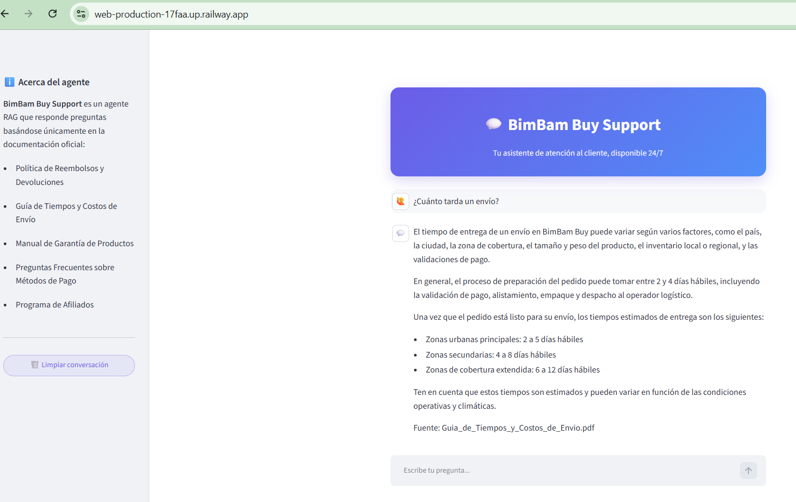
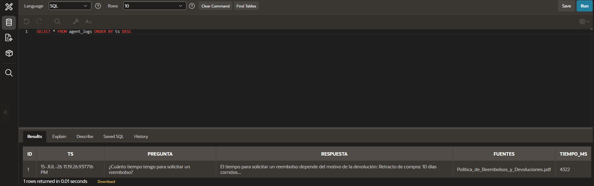
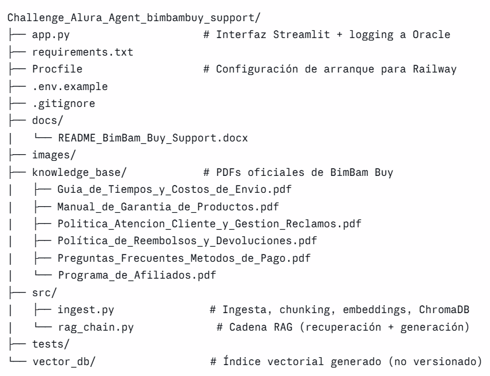

# Challenge_Alura_Agent_bimbambuy_support

BimBam Buy Support — Asistente Inteligente para Atención al Cliente basado en RAG

Asistente de conocimiento impulsado por IA que utiliza Generación Aumentada por Recuperación (RAG) para la documentación de atención al cliente de una e-commerce llamada BimBam Buy.

Se utiliza Oracle Autonomous Database (vía Oracle APEX/ORDS) como servicio del ecosistema OCI para el registro de ejecución del agente, cumpliendo el requisito de despliegue con al menos un servicio OCI, mientras el hosting de la aplicación se realiza en Railway.

Tabla de contenido

Descripción del proyecto
Contexto del Challenge
Problema de negocio
Solución propuesta
Objetivos
Arquitectura de la solución
Tecnologías utilizadas
Base documental
Ejemplos de consultas y respuestas
Evidencia de despliegue en la nube
Registro de ejecución (Oracle APEX / OCI)
Beneficios de la solución
Instalación y ejecución
Estructura del proyecto
Mejoras futuras
Autora

Descripción del proyecto

BimBam Buy Support es un asistente inteligente desarrollado para responder consultas en lenguaje natural sobre la documentación oficial de una empresa ficticia de comercio electrónico llamada BimBam Buy.

La solución implementa la arquitectura Retrieval-Augmented Generation (RAG), combinando búsqueda semántica con modelos de lenguaje para generar respuestas precisas y fundamentadas a partir de documentos corporativos.

El sistema fue desarrollado en Python, utiliza Cohere para la generación de embeddings y respuestas mediante IA, LangChain para la orquestación del flujo RAG, ChromaDB como base de datos vectorial y una interfaz web desarrollada con Streamlit, desplegada en Railway para facilitar el acceso desde cualquier navegador.

Contexto del Challenge

El Challenge Alura Agent busca aplicar los conocimientos adquiridos durante la formación en Inteligencia Artificial mediante la construcción de un asistente capaz de comprender documentos empresariales y responder preguntas utilizando modelos de lenguaje.

Durante el desarrollo se implementaron las principales etapas de una solución basada en IA Generativa:

1. Organización de la documentación
2. Extracción y procesamiento de documentos PDF
3. División del contenido en fragmentos (chunking)
4. Generación de embeddings
5. Almacenamiento en una base de datos vectorial
6. Recuperación de información mediante RAG
7. Generación de respuestas utilizando un modelo de lenguaje
8. Desarrollo de una interfaz web interactiva
9. Publicación de la aplicación en la nube
10. Registro de ejecución en un servicio del ecosistema OCI

Problema de negocio

Las empresas administran una gran cantidad de documentos relacionados con políticas, garantías, procedimientos, envíos, devoluciones y preguntas frecuentes.

Cuando un colaborador o cliente necesita información específica, normalmente debe consultar múltiples documentos antes de encontrar la respuesta correcta, provocando:

- Mayor tiempo de búsqueda.
- Información inconsistente.
- Sobrecarga del equipo de atención al cliente.
- Disminución de la productividad.

Solución propuesta

BimBam Buy Support centraliza el conocimiento corporativo en una base de conocimiento inteligente.

Mediante la arquitectura Retrieval-Augmented Generation (RAG), el asistente identifica automáticamente los fragmentos más relevantes de la documentación almacenada en la base vectorial y genera respuestas fundamentadas únicamente en la información disponible, proporcionando respuestas rápidas, consistentes y confiables.

Objetivos

Objetivo general: desarrollar un asistente inteligente capaz de responder preguntas sobre la documentación corporativa de BimBam Buy mediante la arquitectura Retrieval-Augmented Generation (RAG).

Objetivos específicos:
- Automatizar la consulta de documentación corporativa
- Procesar documentos PDF utilizando Python
- Generar embeddings utilizando Cohere
- Implementar una base vectorial con ChromaDB
- Construir un flujo RAG mediante LangChain
- Generar respuestas utilizando modelos de lenguaje
- Desarrollar una interfaz web interactiva con Streamlit
- Publicar la aplicación utilizando Railway
- Registrar cada ejecución en un servicio del ecosistema OCI (Oracle Autonomous Database vía APEX/ORDS)

Arquitectura de la solución

Flujo de funcionamiento del agente RAG

El funcionamiento del asistente sigue una arquitectura Retrieval-Augmented Generation (RAG) que combina recuperación de información y generación de lenguaje natural.

1. Ingesta de documentos
Los documentos PDF de la empresa se almacenan dentro de la carpeta knowledge_base/. 
El script src/ingest.py:

- Lee todos los documentos
- Extrae el texto (PyPDFLoader)
- Divide el contenido en fragmentos / chunks (RecursiveCharacterTextSplitter)
- Genera embeddings utilizando Cohere
- Almacena los vectores en ChromaDB (vector_db/)

Este proceso solo se ejecuta cuando se agregan o actualizan documentos.

2. Consulta del usuario
El usuario realiza una pregunta desde la interfaz desarrollada con Streamlit. Ejemplo: "¿Cuál es el plazo para solicitar un reembolso?"

3. Búsqueda semántica
La pregunta se transforma en un embedding mediante Cohere. LangChain consulta ChromaDB para recuperar únicamente los fragmentos con mayor similitud semántica (umbral de relevancia configurado en src/rag_chain.py).

4. Generación de la respuesta
Los fragmentos recuperados se envían junto con la consulta al modelo de lenguaje de Cohere (command-r-plus). El modelo genera una respuesta utilizando exclusivamente el contexto recuperado, citando el documento fuente, reduciendo el riesgo de respuestas incorrectas o inventadas.

5. Presentación al usuario
La respuesta se muestra en la interfaz web desarrollada con Streamlit, ofreciendo una experiencia conversacional sencilla e intuitiva.

Tecnologías utilizadas

- Python: desarrollo de la aplicación
- LangChain: orquestación del flujo RAG
- Cohere: generación de embeddings y respuestas mediante IA
- ChromaDB: base de datos vectorial
- PyPDF: procesamiento de documentos PDF
- Streamlit: interfaz web del asistente
- Railway: despliegue de la aplicación en la nube
- Oracle APEX / ORDS / Autonomous Database: servicio del ecosistema OCI utilizado para el registro de ejecución
- Git / GitHub: control de versiones y gestión del repositorio
- Visual Studio Code: entorno de desarrollo

Base documental

El conocimiento del asistente se construye a partir de documentación oficial de BimBam Buy:

- Política de Reembolsos y Devoluciones.
- Programa de Afiliados.
- Guía de Envíos.
- Métodos de Pago.
- Manual de Garantías.
- Customer Service and Claims Policy.

Ejemplos de consultas y respuestas

Pregunta: ¿Cuánto tiempo tengo para solicitar un reembolso?
Respuesta del agente: El tiempo para solicitar un reembolso depende del motivo de la devolución:
- Retracto de compra: 10 días corridos posteriores a la recepción del pedido.
- Producto incorrecto, faltante o con daño visible: 48 horas posteriores a la entrega.
- Falla de funcionamiento: dentro del período de garantía aplicable al producto.
Recuerda que, una vez aprobado el reembolso, el proceso puede tardar entre 5 y 10 días hábiles en completarse, dependiendo del método de pago y el país de origen de la compra.
Fuente: Política_de_Reembolsos_y_Devoluciones.pdf

Pregunta: ¿Quién ganará el mundial de fútbol 2026?
Respuesta del agente: No encontré esta información en la documentación disponible de BimBam Buy. Te recomiendo contactar directamente a soporte al cliente.
(Esta respuesta confirma que el agente no inventa información fuera de su base de conocimiento.)

Otras preguntas que el asistente puede responder:

- ¿Cuáles son los métodos de pago disponibles?
- ¿Qué cubre la garantía?
- ¿Cuánto tarda un envío internacional?
- ¿Cómo puedo presentar un reclamo?
- ¿Qué sucede si recibo un producto dañado?
- ¿Cómo funciona el programa de afiliados?

Beneficios de la solución

Centraliza el conocimiento corporativo.
Reduce el tiempo de búsqueda de información.
Mejora la experiencia del cliente.
Disminuye la carga del equipo de soporte.
Facilita la incorporación de nuevos documentos.
Genera respuestas consistentes y fundamentadas.
Escala fácilmente conforme crece la organización.

Evidencia de despliegue en la nube

Aplicación desplegada en Railway: https://web-production-17faa.up.railway.app/ 
Captura de pantalla de la aplicación funcionando: 

Registro de ejecución (Oracle APEX / OCI)

Como parte del cumplimiento del requisito de usar al menos un servicio del ecosistema OCI, se diseñó e implementó un sistema de registro de ejecución sobre Oracle Autonomous Database, expuesto como endpoint REST mediante Oracle REST Data Services (ORDS) dentro de un workspace de Oracle APEX.

Infraestructura creada: tabla AGENT_LOGS (columnas: pregunta, respuesta, fuentes, tiempo_ms, timestamp), habilitada como recurso AutoREST vía ORDS.ENABLE_OBJECT.
Endpoint REST: https://oracleapex.com/ords/prisi/agent_logs/
Función en el código: log_to_oracle() en app.py, diseñada para enviar cada interacción del agente (pregunta, respuesta, fuentes, tiempo de respuesta) vía POST al endpoint anterior, de forma asíncrona para no bloquear la interfaz.

Limitación encontrada: durante las pruebas de integración se detectó que el hosting gratuito de Oracle APEX (oracleapex.com) bloquea las solicitudes POST automatizadas hacia el endpoint AutoREST mediante su capa de seguridad Akamai (respuesta 403 Forbidden en ~40ms desde AkamaiGHost). Esto se verificó de forma exhaustiva desde 4 entornos distintos e independientes (entorno local, Railway, curl nativo, y la herramienta externa ReqBin), todos con el mismo resultado — confirmando que se trata de una restricción de la infraestructura gratuita de Oracle sobre peticiones POST automatizadas, y no un error de implementación.

Las solicitudes GET (lectura) al mismo endpoint sí responden correctamente, lo que confirma que la tabla y el servicio REST están correctamente configurados y operativos.

Evidencia del funcionamiento: dado que la automatización POST no pudo completarse por la restricción externa descrita, se registró manualmente una interacción real generada por el agente en producción (ver docs/evidencia_logs_oracle.png), demostrando que la infraestructura de OCI (Autonomous Database + ORDS) está correctamente construida y es funcional para el propósito de auditoría y trazabilidad del proyecto.

Instalación y ejecución
1. Clonar el repositorio
   git clone https://github.com/Pw7992/Challenge_Alura_Agent_bimbambuy_support.git 
   cd Challenge_Alura_Agent_bimbambuy_support
2. Crear un entorno virtual
   python -m venv .venv
3. Activarlo
   # Windows
   .venv\Scripts\activate
   # Linux/macOS
   source .venv/bin/activate
4. Instalar dependencias
   pip install -r requirements.txt
6. Configurar variables de entorno
   Crear un archivo .env con las credenciales necesarias (por ejemplo, la API Key de Cohere).
   COHERE_API_KEY=tu_clave_de_cohere
   OCI_LOG_ENDPOINT=https://oracleapex.com/ords/prisi/agent_logs/
7. Generar la base vectorial
   python src/ingest.py
8. Ejecutar la aplicación
   streamlit run app.py
Una vez iniciada, la aplicación podrá utilizarse desde el navegador o accederse mediante la versión desplegada en Railway.

Mejoras futuras

- Historial de conversaciones persistente
- Gestión de usuarios y autenticación
- Carga dinámica de nuevos documentos
- Actualización automática de la base documental
- Soporte para documentos Word, Excel y PowerPoint
- Panel de métricas y analítica de consultas
- Integración con Microsoft Teams y Slack
- Soporte para múltiples idiomas
- Incorporación de memoria conversacional
- Técnicas avanzadas de RAG: Hybrid Search, Re-ranking, Self-RAG

Estructura del proyecto

Autora

Priscila Castellón Vásquez
Proyecto desarrollado: 
Challenge Alura Agent del Programa Oracle One AI TECH BUILDER en colaboración con Alura Latam.
